# Ray Tracer

A CPU-based ray tracer written in C++ for USC's CSCI 420: Computer Graphics.  
Renders 640×480 images of scenes containing spheres and triangles with Phong shading and shadow computation.

---

## Features

- Ray generation per pixel
- Ray-sphere and ray-triangle intersection
- Phong shading (ambient, diffuse, specular)
- Shadow rays for each light source
- JPEG output

## Extra Credit

| Feature | Branch |
|---|---|
| Anti-Aliasing | [antialiasing](https://github.com/pranavsrathod/Ray-Tracing/tree/antialiasing) |
| Recursive Reflections | [reflections](https://github.com/pranavsrathod/Ray-Tracing/tree/reflections) |

---

## Build Instructions

### macOS (Apple Silicon / Intel)

Build the included libjpeg from source first:

```bash
cd external/jpeg-9a-mac
chmod +x configure
./configure --prefix=$(pwd)
make clean
make
chmod +x install-sh
make install
```

Then build the ray tracer:

```bash
cd hw3-starterCode
make
```

### Linux

```bash
sudo apt-get install freeglut3-dev libjpeg-dev
cd hw3-starterCode
make
```

---

## Usage

```bash
./hw3 <scene_file> [output.jpg]
```

Display only:
```bash
./hw3 test1.scene
```

Display and save:
```bash
./hw3 spheres.scene spheres.jpg
```

---

## Scene Files

| Scene | Description |
|---|---|
| `test1.scene` | Single gray sphere with one white light |
| `test2.scene` | Triangle ground plane with a sphere |
| `spheres.scene` | Five spheres |
| `table.scene` | Table and boxes |
| `SIGGRAPH.scene` | SIGGRAPH logo |
| `toy.scene` | Toy scene |
| `snow.scene` | Snowman scene |

---

## Example Renders

| Scene | Flat Shading | Sphere Shading | Triangle Shading | Shadows | Anti-Aliasing |
|---|---|---|---|---|---|
| Snow |  | 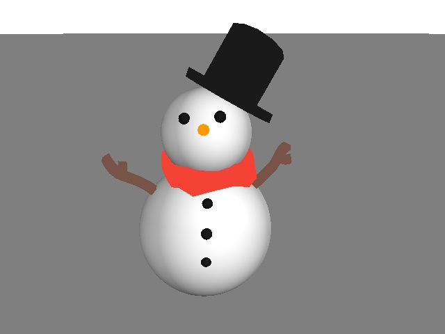 | 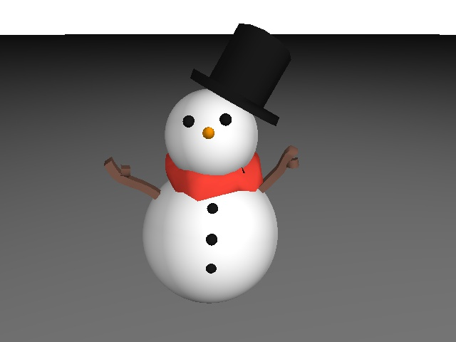 | 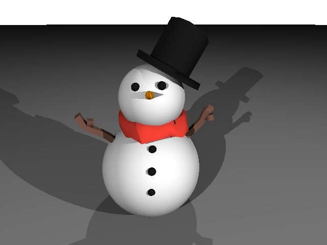 |  |
| Spheres | 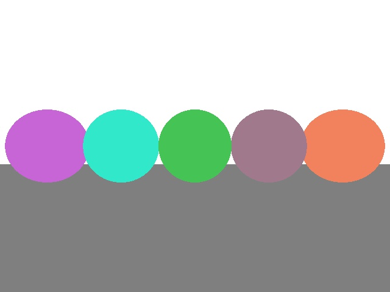 | 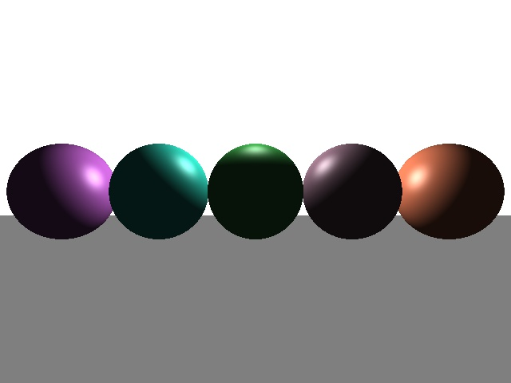 | 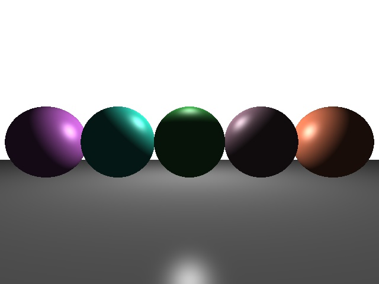 | 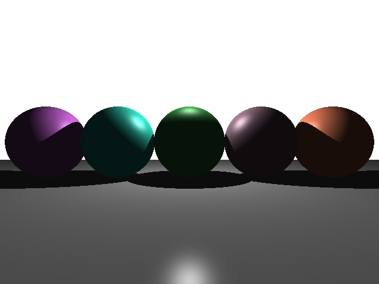 |  |
| Table | 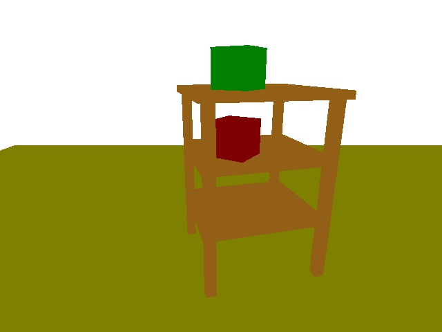 |  | 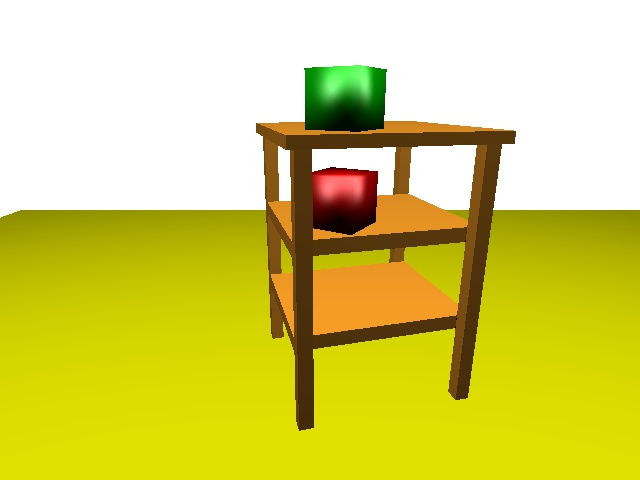 | 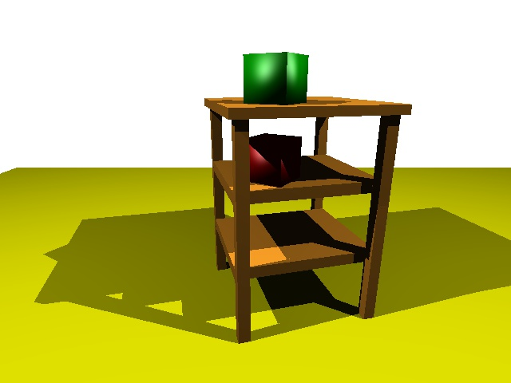 |  |
| Test2 | 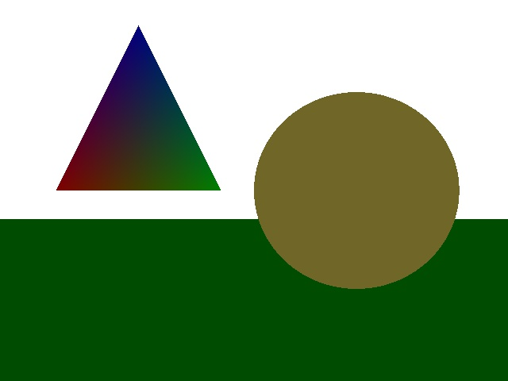 | 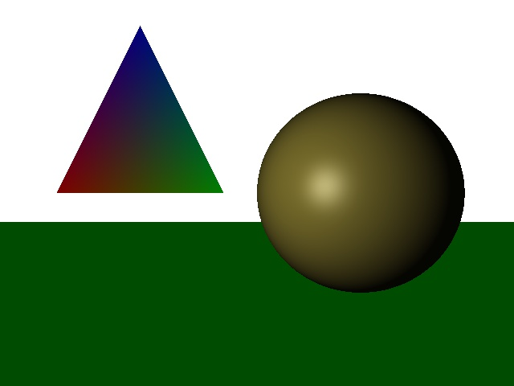 | 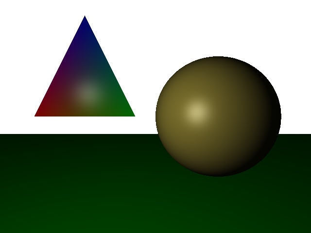 |  | 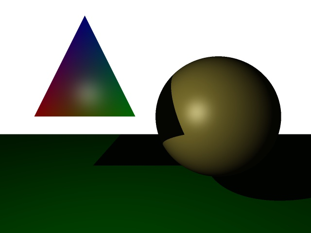 |
| Toy |  | 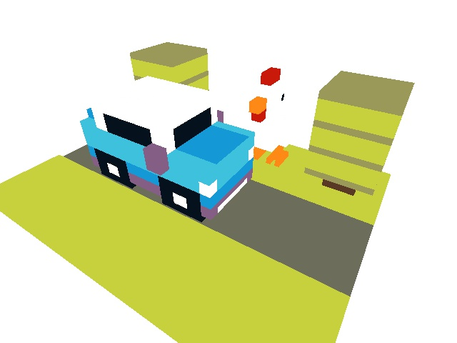 | 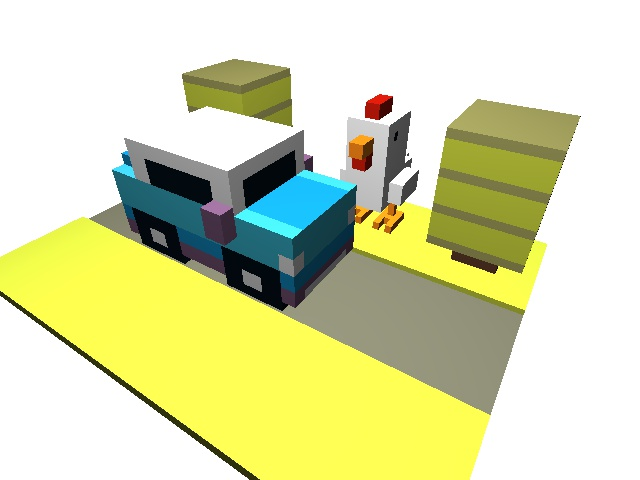 |  | 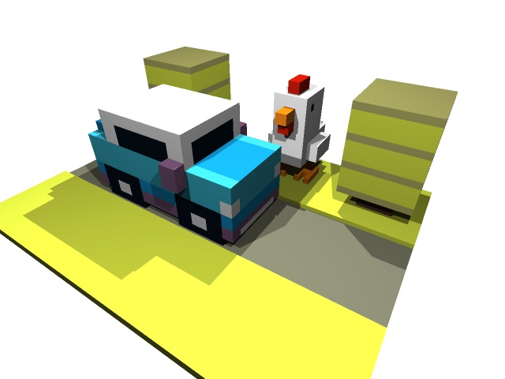 |
| SIGGRAPH | 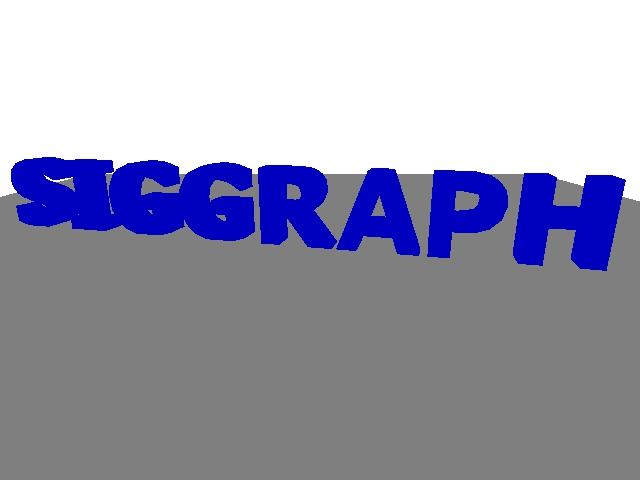 |  | 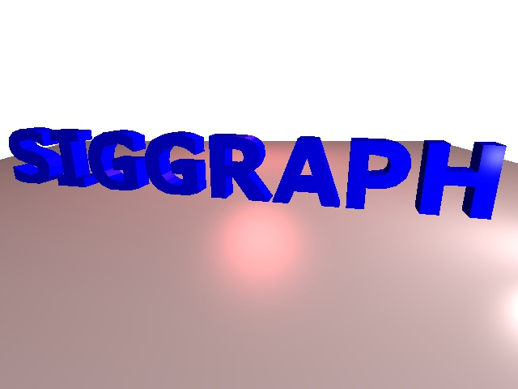 | 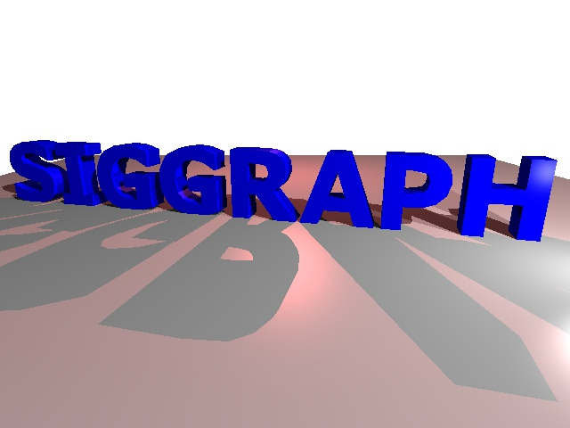 | 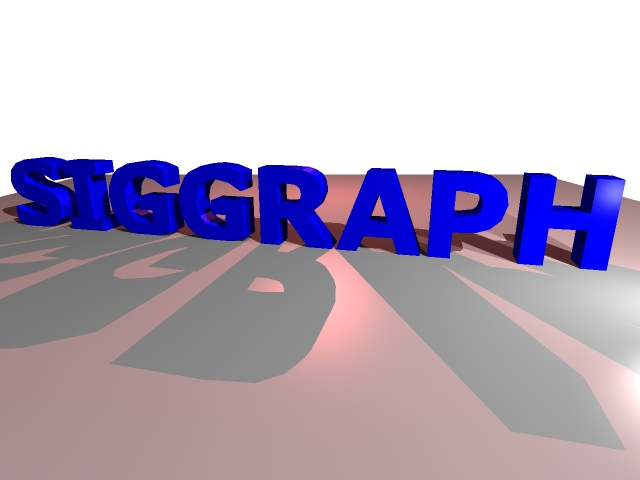 |

Recursive reflections at varying depth:

| Scene | Depth 1 | Depth 2 | Depth 3 |
|---|---|---|---|
| Spheres | 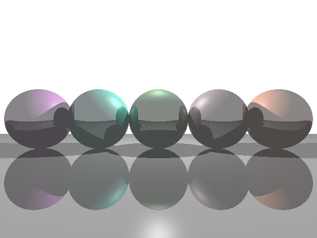 | 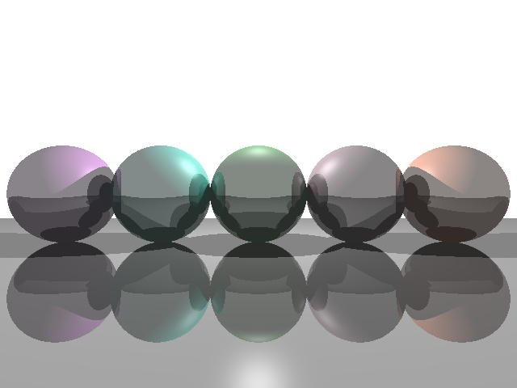 | 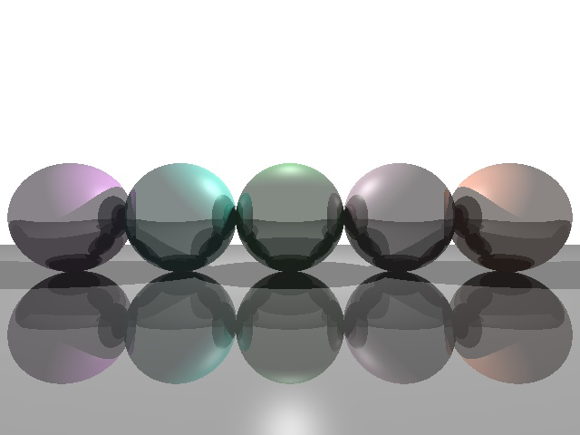 |
| Test2 |  | 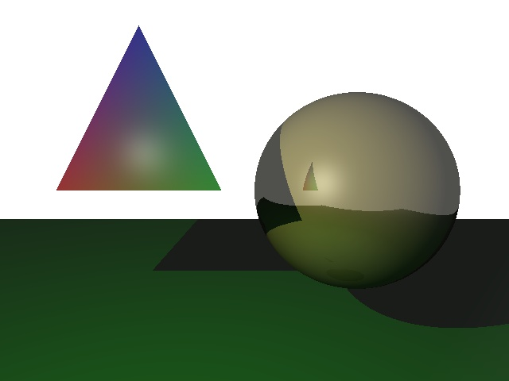 |  |
| SIGGRAPH |  |  | 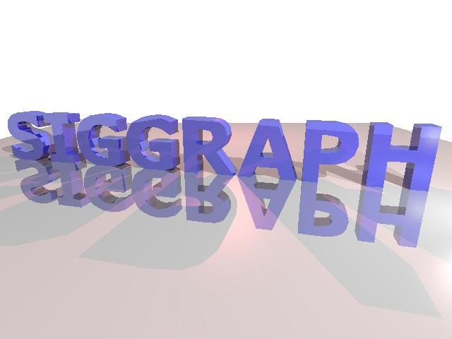 |

---

## Cleanup

```bash
make clean
```
